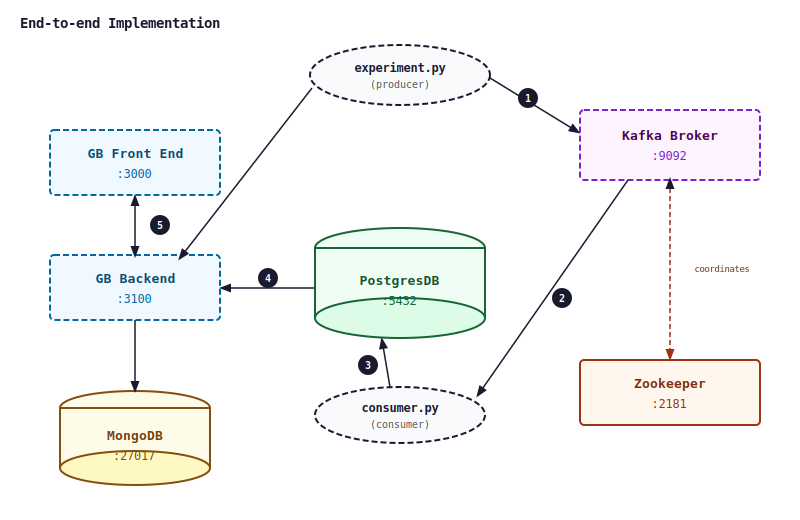

# GrowthBook End-to-End Implementation

A portfolio project demonstrating end-to-end A/B testing infrastructure using GrowthBook, with both Bayesian and frequentist statistical approaches implemented from scratch in Python.

## Overview

This repo covers the full experimentation lifecycle: feature flagging, experiment assignment, results analysis, and statistical inference. It mirrors how modern experimentation platforms like GrowthBook operate under the hood, with explicit implementations of the two dominant statistical paradigms.

## Repository Structure

```
growthbook/
├── system_design/
│   └── growthbook_architecture.svg  # System design: data model, event pipeline, assignment logic
├── experiment.py                    # Feature flag script generating exposures
├── consumer.py                       # Kafka consumer script
├── generate_metrics.py               # Synthetic metric generation for experiment analysis
├── bayesian_stats.py                 # Bayesian approach: Normal/Normal, credible intervals
├── frequentist_stats.py              # Frequentist approach: t-test, p-values, power analysis
├── learnings.md                      # Notes taken while building the implementation
├── docker-compose.yml                # Docker compose configuration
└── README.md
```

## System Design

  

- **Experiment assignment**: user bucketing via deterministic hashing, traffic splitting, holdout groups
- **Event schema**: impression and conversion events, deduplication, session stitching
- **Data pipeline**: raw events to experiment results table (modeled in SQL/dbt style)
- **Feature flag lifecycle**: draft, running, stopped, and archived states

## Statistical Approaches

### Bayesian (`bayesian_stats.py`)

GrowthBook defaults to Bayesian inference, which is now the industry standard in most modern platforms.
This script recreates the Bayesian calculations in the GrowthBook statistical engine.

- Flat prior with closed-form Normal/Normal conjugate posterior
- Relative lift variance via the delta method (`Var(M/D)` approximation)
- Chance to win, expected loss, and 95% credible intervals

### Frequentist (`frequentist_stats.py`)

This script recreates the Frequentist calculations in the GrowthBook statistical engine.

- Welch's t-test which does not assume equal variance between groups (use delta method)
- Welch-Satterthwaite degrees of freedom for unequal sample sizes
- Two-sided p-value and 95% confidence interval


## Requirements

```
numpy
scipy
pandas
matplotlib
```

## References

- [GrowthBook Statistics Documentation](https://docs.growthbook.io/statistics)
- Kohavi et al., *Trustworthy Online Controlled Experiments*
