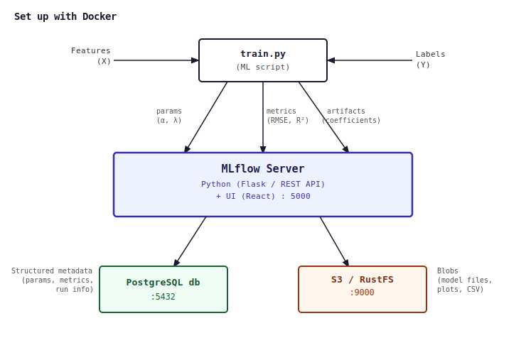

# MLflow End-to-End Implementation

A portfolio project demonstrating end-to-end ML experiment tracking and model management using MLflow, with hands-on implementations spanning classical ML, Strava data modeling, and GenAI evaluation pipelines.

## Overview

This repo covers the full ML lifecycle using MLflow as the central tracking and registry layer: from raw data and feature engineering through model training, evaluation, registration, and serving. It includes both classical ML and GenAI workloads to demonstrate breadth.

## Repository Structure

```
mlflow/
├── system_design/
│   └── mlflow_architecture.svg      # System design: tracking server, artifact store, model registry
├── strava_scripts/
│   ├── feature_engineering.py       # Strava activity data: pace, HR zones, elevation, TSS
│   ├── train_classical_ml.py        # sklearn models logged to MLflow: Ridge, RF, XGBoost
│   └── strava_schema.sql            # Data model for Strava activities
├── genai_evals/
│   ├── eval_pipeline.py             # LLM eval framework logged to MLflow
│   ├── qwen_local_runner.py         # Qwen3.5 30B inference via local endpoint
│   └── eval_metrics.py              # Custom metrics: relevance, faithfulness, toxicity
├── requirements.txt
└── README.md
```

## System Design

 

- **Tracking server**: experiment, run, and metric storage; local vs. remote backend
- **Artifact store**: model binaries, plots, confusion matrices, eval outputs
- **Model registry**: staging, production, and archived model versions with lineage
- **Serving layer**: MLflow model server, REST API, batch vs. real-time inference patterns

## Modules

### 1. Strava Data Modeling (`strava_scripts/`)

End-to-end ML pipeline using personal Strava activity data, tracked in MLflow.

- **Features**: average pace, HR zones, elevation gain, TSS (training stress score), rest days, rolling 4-week volume
- **Target**: predicted race performance (e.g., 5K equivalent, marathon finish time)
- **Models**: Ridge regression, Random Forest, XGBoost, with MLflow comparison across runs
- **Logged artifacts**: feature importance plots, learning curves, residual analysis

### 2. GenAI Evals (`genai_evals/`)

LLM evaluation pipeline using local Qwen3.5 30B, with results tracked in MLflow.

- **Eval framework**: custom metrics logged as MLflow scalars per run
- **Metrics**: relevance (embedding cosine similarity), faithfulness (NLI-based), response length, latency
- **Local inference**: Qwen3.5 30B via local endpoint (OpenAI-compatible API)

```python
import mlflow

with mlflow.start_run(run_name="qwen_eval_v1"):
    mlflow.log_param("model", "qwen3.5-30b")
    mlflow.log_param("prompt_version", "v3")
    mlflow.log_metric("relevance_score", relevance)
    mlflow.log_metric("faithfulness", faithfulness)
    mlflow.log_metric("avg_latency_ms", latency)
```

## Key Design Decisions

| Decision | Rationale |
|---|---|
| Local MLflow tracking server | No infra cost, reproducible across machines |
| Strava as training data | Real personal data, avoids leakage concerns, meaningful features |
| Qwen3.5 30B local for evals | No API cost, privacy-safe, sufficient capability for eval tasks |

## Requirements

```
mlflow
numpy
pandas
scikit-learn
xgboost
matplotlib
openai          # for local Qwen OpenAI-compatible endpoint
sentence-transformers  # for GenAI eval embedding metrics
```

## Running the Project

```bash
# Start local MLflow tracking server
mlflow server --host 127.0.0.1 --port 5000

# Run Strava modeling pipeline
python strava_scripts/train_classical_ml.py

# Run GenAI eval pipeline (requires local Qwen endpoint running)
python genai_evals/eval_pipeline.py

# Open MLflow UI
open http://127.0.0.1:5000
```

## References

- [MLflow Documentation](https://mlflow.org/docs/latest/index.html)
- Friedman et al., "Regularization Paths for Generalized Linear Models via Coordinate Descent" (2010)
- [Strava API Documentation](https://developers.strava.com)
